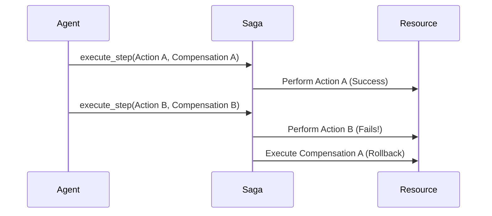

# genpark-compensation-saga-rollback-orchestrator-skill

Distributed Saga orchestrator executing compensating rollbacks in reverse topological order when external API or agent steps fail.

## Architecture

## Features
- **Strict LIFO Rollback**: Undoes operations in exact reverse order.
- **Zero Dependencies**: 100% Python Standard Library.
